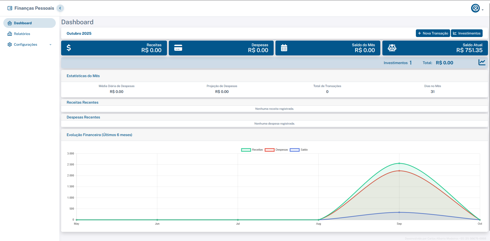
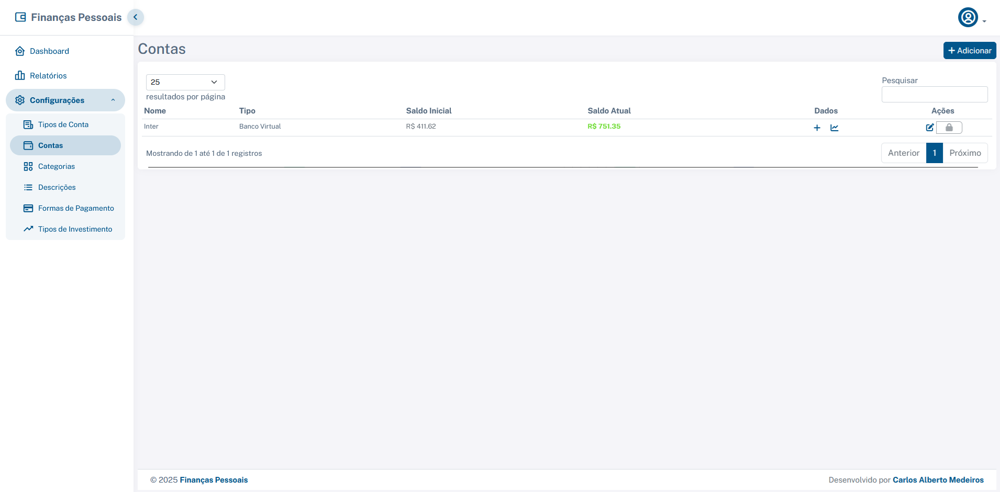
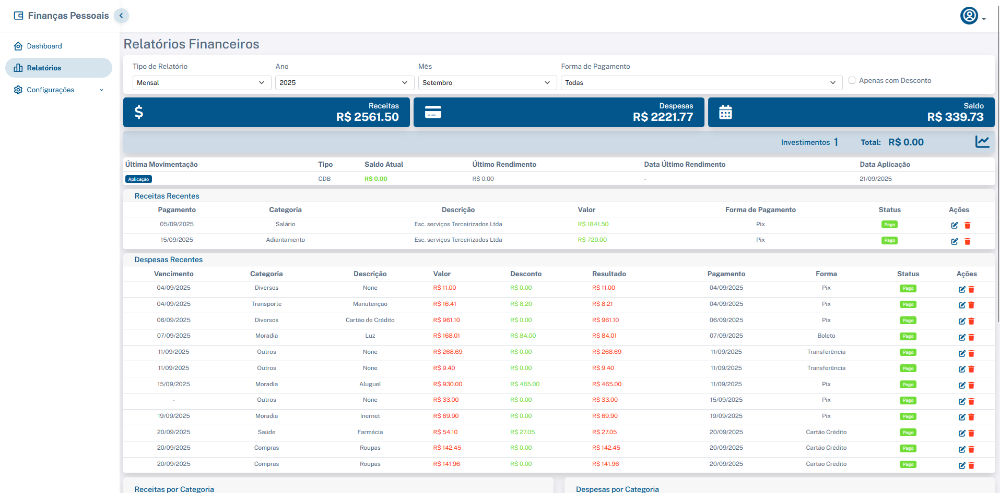

# SFP - Sistema de Financas Pessoais

Aplicacao web para gestao financeira pessoal, desenvolvida em Flask, com operacao local, autenticacao de usuarios, controle de contas, receitas, despesas, investimentos, relatorios e uma camada de consistencia baseada em ledger imutavel.

O projeto principal e o SFP Flask. O repositorio tambem contem o subprojeto `sa-saas/`, um monorepo TypeScript separado para um SaaS de inteligencia de conteudo. Ele nao faz parte do runtime do SFP, mas esta documentado porque compartilha o mesmo repositorio.

## Demonstracao

Capturas versionadas em `Exibição/`:







Execucao local esperada:

```text
SFP Flask: http://127.0.0.1:5000
SA SaaS Web: http://localhost:3000
SA SaaS API: http://localhost:4000
```

## Arquitetura Do Sistema

### Sistema principal: SFP Flask

O SFP e um monolito modular server-side. A interface e renderizada com Jinja2, as regras financeiras criticas estao parcialmente isoladas em servicos, e a persistencia e feita com SQLAlchemy.

| Camada | Responsabilidade | Arquivos |
|---|---|---|
| Inicializacao | app factory, extensoes Flask, blueprints, backup, dados padrao e reparos legados | `app/__init__.py` |
| Runtime local | validacao de Python, abertura de navegador, shutdown assistido e backup ao sair | `run.py` |
| HTTP/UI | rotas web, renderizacao de templates e orquestracao de formularios | `app/routes.py`, `routes/*.py` |
| Formularios | validacoes de entrada com WTForms | `app/forms.py` |
| Dominio/persistencia | modelos SQLAlchemy e relacionamentos | `app/models.py` |
| Servicos | regras de negocio, ledger, fechamento, investimentos e analitica | `services/*.py` |
| Migracoes | evolucao de schema com Alembic/Flask-Migrate | `migrations/` |
| Interface | templates, CSS, JavaScript e assets locais | `app/templates/`, `app/static/` |
| Testes | testes de modelos, rotas, servicos e helpers | `tests/` |

O desenho atual nao e uma arquitetura em camadas pura: `app/routes.py` ainda concentra bastante regra de apresentacao e parte da regra de relatorios. Ainda assim, as regras com maior risco financeiro ja foram movidas para servicos, especialmente ledger, transacoes, fechamento e investimentos.

### Subprojeto: SA SaaS

`sa-saas/` e um monorepo independente:

| Area | Responsabilidade | Arquivos |
|---|---|---|
| Web | frontend Next.js/React | `sa-saas/apps/web` |
| API | API Express/TypeScript | `sa-saas/apps/api` |
| Banco | schema Prisma/PostgreSQL | `sa-saas/apps/api/prisma/schema.prisma` |
| Compartilhado | tipos e nucleo de IA | `sa-saas/packages/shared`, `sa-saas/packages/ai-core` |

## Stack Tecnologica

### Backend SFP

- Python 3.10+
- Flask
- Flask-Login
- Flask-SQLAlchemy
- Flask-Migrate / Alembic
- Flask-WTF / WTForms
- Flask-Mail
- SQLAlchemy
- Werkzeug / itsdangerous

### Persistencia E Dados

- SQLite como padrao local
- PostgreSQL ou outro banco suportado por SQLAlchemy via `DATABASE_URL`
- Migrações versionadas em `migrations/`
- Ledger imutavel com hash chain para eventos financeiros

### Frontend SFP

- Jinja2
- Bootstrap local
- JavaScript proprio
- CSS local
- assets offline em `app/static/`

### Qualidade E Operacao

- pytest
- pytest-cov
- logs JSON opcionais
- backup automatico trimestral
- scripts Windows para inicializacao

### SA SaaS

- Node.js com Corepack/pnpm
- TypeScript
- Next.js 15
- React 19
- Express
- Prisma
- PostgreSQL
- Zod
- JWT
- Tailwind CSS

## Estrutura Do Projeto

```text
.
├── app/
│   ├── __init__.py        # app factory, extensoes, backup e bootstrap de dados
│   ├── forms.py           # formularios e validacoes WTForms
│   ├── middleware.py      # compatibilidade entre navegadores
│   ├── models.py          # modelos SQLAlchemy
│   ├── routes.py          # rotas principais: auth, dashboard, transacoes e relatorios
│   ├── static/            # CSS, JS, imagens e assets locais
│   └── templates/         # telas Jinja2
├── routes/
│   ├── conta.py           # contas financeiras
│   ├── investimento.py    # investimentos e movimentacoes
│   ├── tipo_conta.py      # tipos de conta
│   ├── tipo_investimento.py
│   └── transactions.py    # blueprint legado, nao registrado no bootstrap principal
├── services/
│   ├── transaction_service.py
│   ├── investment_service.py
│   ├── ledger_service.py
│   ├── closure_service.py
│   ├── projection_service.py
│   ├── anomaly_detection_service.py
│   ├── ai_classification_service.py
│   ├── data_quality_service.py
│   └── report_service.py
├── migrations/            # Alembic
├── tests/                 # suite pytest
├── docs/sfp_v3/           # diagnostico e proposta tecnica da evolucao V3
├── scripts/               # utilitarios, incluindo seed demo
├── sistema/               # scripts auxiliares Windows
├── sa-saas/               # monorepo TypeScript separado
├── config.py              # configuracao por ambiente
├── run.py                 # launcher principal do SFP
├── requirements.txt
├── requirements-dev.txt
└── pytest.ini
```

## Funcionalidades Por Dominio

### Usuarios E Autenticacao

- cadastro de usuarios;
- login e logout;
- perfil com alteracao de email e senha;
- recuperacao de senha por token;
- rate limit simples em memoria para tentativas de login;
- criacao automatica de usuario `admin` quando a base esta vazia.

### Cadastros Financeiros

- categorias por usuario;
- descricoes/despesas vinculadas a categorias;
- formas de pagamento ativas ou inativas;
- contas financeiras;
- tipos de conta;
- tipos de investimento.

### Transacoes

- receitas e despesas;
- data de criacao, vencimento e pagamento;
- controle de pago/nao pago;
- desconto em despesas;
- recorrencia diaria, semanal ou mensal no formulario;
- associacao com conta, categoria, descricao e forma de pagamento;
- inclusao, edicao, exclusao e replicacao de lancamentos;
- validacao de ownership dos dados relacionados.

### Contas E Saldos

- saldo inicial e saldo atual por conta;
- recalculo de saldos a partir do ledger;
- isolamento por usuario;
- associacao de transacoes e investimentos a contas.

### Investimentos

- cadastro de investimentos por tipo;
- movimentacoes de aplicacao, resgate e rendimento;
- edicao e exclusao de movimentacoes;
- recalculo de saldos;
- impacto financeiro na conta vinculada via camada de servicos.

### Ledger, Fechamento E Consistencia

- `LedgerEntry` com `previous_hash` e `current_hash`;
- validacao de integridade por usuario e conta;
- backfill de dados legados;
- fechamento mensal com bloqueio de periodo;
- ledger separado para simulacoes.

### Relatorios E Exportacao

- dashboard financeiro;
- relatorios mensais e anuais;
- filtros por periodo, conta, forma de pagamento e desconto;
- relatorios por forma de pagamento;
- relatorio de descontos;
- exportacao JSON dos dados do usuario autenticado.

### Analitica Local

- projecao de fluxo de caixa;
- score simples de saude financeira;
- deteccao estatistica de anomalias;
- verificacao de qualidade dos dados;
- classificacao textual local por usuario.

## Instalacao E Execucao

### SFP Flask

1. Acesse o diretorio do projeto:

```powershell
cd "C:\Arquivos\PROJETOS\Sistemas\SFP_financeiro\Flask"
```

2. Crie e ative o ambiente virtual:

```powershell
python -m venv venv
.\venv\Scripts\activate
```

3. Instale as dependencias:

```powershell
pip install -r requirements.txt
```

4. Execute a aplicacao:

```powershell
python run.py
```

5. Acesse:

```text
http://127.0.0.1:5000
```

Credenciais iniciais quando a base estiver vazia:

```text
Usuario: admin
Senha: admin123
```

Para rodar sem abertura automatica do navegador:

```powershell
$env:SFP_NO_BROWSER = "1"
python run.py
```

### SA SaaS

1. Acesse o subprojeto:

```powershell
cd "C:\Arquivos\PROJETOS\Sistemas\SFP_financeiro\Flask\sa-saas"
```

2. Instale dependencias:

```powershell
corepack enable
corepack pnpm install
```

3. Configure PostgreSQL e variaveis de ambiente.

4. Gere o client Prisma:

```powershell
corepack pnpm --filter @sa/api prisma:generate
```

5. Execute:

```powershell
corepack pnpm dev
```

## Variaveis De Ambiente

### SFP

| Variavel | Obrigatoria | Descricao |
|---|---:|---|
| `SECRET_KEY` ou `FLASK_SECRET_KEY` | Sim em producao | chave de sessao Flask |
| `DATABASE_URL` | Nao | sobrescreve o SQLite padrao |
| `SESSION_COOKIE_SECURE` | Nao | exige HTTPS no cookie de sessao |
| `REMEMBER_COOKIE_SECURE` | Nao | exige HTTPS no cookie remember-me |
| `LOGIN_RATE_LIMIT_ATTEMPTS` | Nao | tentativas permitidas na janela |
| `LOGIN_RATE_LIMIT_WINDOW_SECONDS` | Nao | janela do rate limit |
| `SFP_BACKUP_DIR` | Nao | diretorio de backup |
| `SFP_ENABLE_AUTO_BACKUP` | Nao | liga/desliga backup automatico |
| `SFP_JSON_LOGS` | Nao | habilita logs JSON |
| `SFP_LOG_LEVEL` | Nao | nivel de log |
| `MAIL_SERVER` | Nao | servidor SMTP |
| `MAIL_PORT` | Nao | porta SMTP |
| `MAIL_USE_TLS` | Nao | TLS para SMTP |
| `MAIL_USERNAME` | Nao | usuario SMTP |
| `MAIL_PASSWORD` | Nao | senha SMTP |
| `MAIL_DEFAULT_SENDER` | Nao | remetente padrao |
| `MAIL_SUPPRESS_SEND` | Nao | suprime envio real de email |
| `MAIL_DEBUG` | Nao | debug de email |
| `SFP_BROWSER_PATH` | Nao | caminho manual para Edge/Chrome |
| `SFP_NO_BROWSER` | Nao | desativa abertura automatica |
| `SFP_VALIDATE_ONLY` | Nao | evita abertura do navegador |

Observacao importante: `DATABASE_URL` e usada tanto pelo Flask quanto pelo subprojeto `sa-saas/` se estiver no ambiente. Para evitar apontamento acidental para o banco errado, use arquivos/ambientes separados.

### SA SaaS

| Variavel | Obrigatoria | Descricao |
|---|---:|---|
| `JWT_SECRET` | Sim | assinatura de tokens |
| `DATABASE_URL` | Condicional | URL PostgreSQL completa |
| `DATABASE_HOST` | Condicional | host alternativo quando `DATABASE_URL` nao existe |
| `DATABASE_PORT` | Nao | porta PostgreSQL |
| `DATABASE_NAME` | Condicional | nome do banco |
| `DATABASE_USER` | Condicional | usuario do banco |
| `DATABASE_PASSWORD` | Condicional | senha do banco |
| `API_PORT` | Nao | porta da API |
| `AI_PROVIDER` | Nao | `mock`, `openai` ou `anthropic` |
| `OPENAI_API_KEY` | Condicional | chave OpenAI |
| `ANTHROPIC_API_KEY` | Condicional | chave Anthropic |

## Endpoints

### SFP Flask

| Metodo | Rota | Finalidade |
|---|---|---|
| `GET` | `/` | entrada da aplicacao |
| `GET` | `/dashboard` | dashboard principal |
| `GET/POST` | `/auth/register` | cadastro |
| `GET/POST` | `/auth/login` | login |
| `GET` | `/auth/logout` | logout |
| `GET/POST` | `/auth/profile` | perfil |
| `GET/POST` | `/auth/reset_request` | solicitacao de reset |
| `GET/POST` | `/auth/reset_password/<token>` | redefinicao de senha |
| `GET` | `/transactions/categories` | categorias |
| `GET/POST` | `/transactions/categories/add` | nova categoria |
| `GET/POST` | `/transactions/category/edit/<id>` | editar categoria |
| `GET` | `/transactions/expenses` | descricoes/despesas |
| `GET/POST` | `/transactions/expenses/add` | nova descricao |
| `GET` | `/transactions/payment_methods` | formas de pagamento |
| `GET/POST` | `/transactions/payment_methods/add` | nova forma de pagamento |
| `GET` | `/transactions/reports` | relatorios |
| `GET` | `/transactions/export` | exportacao JSON |
| `GET` | `/transactions/transactions` | lancamentos |
| `GET/POST` | `/transactions/transactions/add` | novo lancamento |
| `GET/POST` | `/transactions/transactions/edit/<id>` | editar lancamento |
| `GET` | `/transactions/transactions/delete/<id>` | excluir lancamento |
| `GET` | `/transactions/transactions/replicate/<id>` | replicar lancamento |
| `GET` | `/conta/contas` | contas |
| `GET/POST` | `/conta/contas/add` | nova conta |
| `GET/POST` | `/conta/conta/editar/<conta_id>` | editar conta |
| `POST` | `/conta/conta/excluir/<conta_id>` | excluir conta |
| `GET` | `/tipo-conta/tipos-conta` | tipos de conta |
| `GET/POST` | `/tipo-conta/tipo-conta/novo` | novo tipo de conta |
| `GET` | `/tipo-investimento/tipos-investimento` | tipos de investimento |
| `GET` | `/investimento/investimentos` | investimentos |
| `POST` | `/investimento/investimentos/novo` | novo investimento |
| `GET/POST` | `/investimento/investimento/<id>/movimentacoes` | movimentacoes |
| `POST` | `/investimento/investimento/<id>/recalcular-saldos` | recalculo de investimento |
| `GET` | `/debug/browser` | diagnostico de navegador |
| `GET` | `/shutdown` | shutdown assistido com backup |

### SA SaaS API

As rotas sao montadas sob `/api`:

| Prefixo | Finalidade |
|---|---|
| `/api/auth` | autenticacao e workspace |
| `/api/brand-dna` | DNA de marca |
| `/api/strategy` | estrategia |
| `/api/adaptation` | adaptacao de conteudo |
| `/api/orchestrator` | orquestracao e prompts |
| `/api/image-prompts` | prompts de imagem |
| `/api/scoring` | pontuacao |
| `/api/feedback` | feedback |

## Testes

Instale dependencias de desenvolvimento:

```powershell
pip install -r requirements.txt -r requirements-dev.txt
```

Execute:

```powershell
pytest -q
```

O `pytest.ini` exige cobertura minima de 70% para `services` e `app.models`:

```text
--cov=services --cov=app.models --cov-report=term-missing --cov-fail-under=70
```

Estado observado nesta geracao: a execucao de `pytest -q` no Python ativo falhou antes de carregar a suite por ausencia de `flask` instalado (`ModuleNotFoundError: No module named 'flask'`). Portanto, este documento nao afirma que a suite esta verde.

Nao foram identificados testes automatizados versionados para o subprojeto `sa-saas/`.

## Decisoes Tecnicas

### Monolito Modular Em Flask

O Flask e adequado ao escopo atual: aplicacao server-side, operacao local, baixa complexidade de deploy e uso intensivo de formularios. A escolha reduz custo operacional e facilita empacotamento para Windows.

O custo dessa decisao e o risco de crescimento de arquivos centrais. Esse risco ja aparece em `app/routes.py`, que concentra rotas e logica demais.

### Ledger Imutavel Para Saldos

O projeto evita depender exclusivamente de mutacao direta de `saldo_atual`. O ledger registra eventos financeiros assinados por hash chain, permitindo reconstruir saldo e detectar adulteracao.

Essa decisao e importante porque saldo financeiro e estado derivado. O historico dos eventos deve ser a fonte auditavel, enquanto o saldo pode ser recalculado.

### Fechamento Mensal

O fechamento mensal torna periodos financeiros imutaveis apos consolidacao. Essa regra impede alteracoes retroativas em meses fechados e aproxima o sistema de uma pratica contábil mais confiavel.

### Servicos Para Regras Criticas

Transacoes, investimentos, ledger, fechamento, projecoes e qualidade de dados foram movidos para `services/`. Isso melhora testabilidade e reduz o acoplamento entre HTTP e dominio.

Essa extracao ainda esta incompleta: relatorios e algumas orquestracoes seguem pesadas em rotas.

### Operacao Local E Backup Automatico

O launcher `run.py` gerencia abertura de navegador, shutdown e backup. A decisao favorece usuarios nao tecnicos em ambiente Windows e reduz chance de perda de dados.

O trade-off e maior complexidade operacional dentro do proprio app, incluindo codigo especifico para Windows.

### Suporte A SQLite E DATABASE_URL

SQLite simplifica uso local. `DATABASE_URL` abre caminho para PostgreSQL ou outros bancos via SQLAlchemy.

O risco atual e a colisao com o `DATABASE_URL` usado pelo `sa-saas/`, ja que ambos os sistemas podem ler a mesma variavel.

### Subprojeto SA SaaS Isolado

Manter `sa-saas/` separado evita acoplamento direto com o Flask e permite demonstrar uma stack moderna TypeScript/Next/Prisma.

Como esta no mesmo repositorio, a fronteira de produto precisa ser bem documentada para nao confundir manutencao, CI e deploy.

## Melhorias Futuras

### Criticas

- Separar oficialmente SFP e `sa-saas/` em repositorios distintos ou criar uma estrategia clara de monorepo multi-produto.
- Quebrar `app/routes.py` em blueprints menores por dominio: auth, dashboard, transacoes, relatorios e cadastros.
- Remover ou aposentar `routes/transactions.py`, que aparenta ser legado e nao entra no bootstrap principal.
- Padronizar variaveis de ambiente para evitar conflito de `DATABASE_URL` entre Flask e SA SaaS.
- Criar CI executando `pytest`, cobertura, lint/typecheck do SA SaaS e validacao de migrations.
- Revisar o usuario admin automatico antes de qualquer uso fora de ambiente local.

### Importantes

- Criar testes automatizados para `sa-saas/`.
- Formalizar empacotamento Windows do SFP com instalador ou pipeline de release.
- Extrair relatorios para `ReportService` de forma mais completa.
- Melhorar observabilidade de backup, integridade de ledger e fechamento mensal.
- Revisar rotas destrutivas que usam `GET`, como exclusao de lancamentos, para usar `POST`/`DELETE`.
- Isolar melhor dados de runtime, banco local e arquivos de backup.
- Documentar estrategia de migracao entre SQLite e PostgreSQL.

## Contribuicao

Como o repositorio contem mais de um sistema, toda contribuicao deve declarar o escopo:

- `SFP Flask`;
- `SA SaaS`;
- documentacao;
- infraestrutura.

Fluxo recomendado:

1. Crie uma branch por alteracao.
2. Evite misturar mudancas de SFP e SA SaaS no mesmo PR.
3. Execute os testes/validacoes do escopo alterado.
4. Documente impactos em banco, migrations, ledger, autenticacao ou variaveis de ambiente.
5. Para mudancas financeiras, inclua cenarios de teste cobrindo saldo, ledger e ownership por usuario.

## Licenca

Nenhuma licenca foi encontrada no repositorio.

Na ausencia de uma licenca explicita, assuma que todos os direitos permanecem reservados ao autor do projeto.
